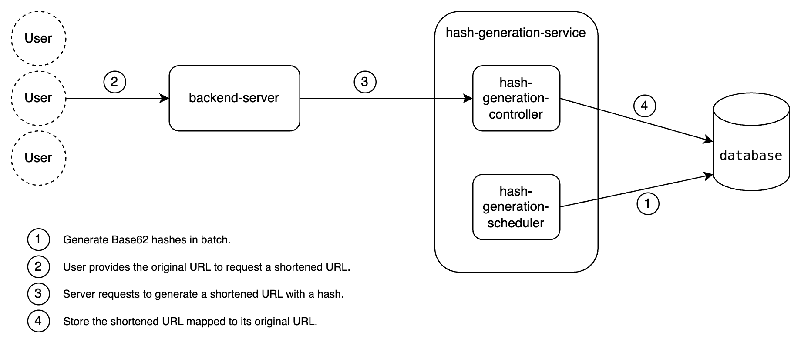

# Url Shortener

This project implements a Hash Generation Service and a Backend Server for creating and fetching encoded hashes for URLs. The service allows users to shorten URLs and redirect to the original URLs using a simple RESTful API.



## Table of Contents

- [Overview](#overview)
- [Features](#features)
- [Endpoints](#endpoints)
    - [Create Encoded URL](#1-create-encoded-url)
    - [Retrieve Original URL](#2-retrieve-original-url)
- [Usage](#usage)
- [How to Run](#how-to-run)

## Overview

The core functionality of this application is to provide a URL shortening service with the following features:

- Create a shortened URL that maps to an original URL.
- Retrieve the original URL by using the shortened hash.
- Scheduled hash generation to ensure availability.

## Features

- RESTful API for URL shortening.
- Automatic encoding of original URLs to unique hashes.
- Scheduled task to maintain a threshold of available hashes for quick access.

## Endpoints

### 1. Create Encoded URL

- **URL**: `/create`
- **Method**: `POST`
- **Parameters**:
    - `originalUrl` (required, string): The original URL to be encoded.
- **Responses**:
    - **201 Created**: Returns the encoded URL.
    - **400 Bad Request**: The provided URL is invalid.
    - **404 Not Found**: No available hashes.

#### Example Request

```http
POST /create
Content-Type: application/json

{
    "originalUrl": "http://example.com"
}
```

### 2. Retrieve Original URL

- **URL**: `/{hash}`
- **Method**: `GET`
- **Parameters**:
    - `hash` (required, string): The encoded hash that maps to the original URL.
- **Responses**:
    - **302 Found**: Redirects to the original URL.
    - **400 Bad Request**: The provided hash is invalid.
    - **404 Not Found**: No mapping exists for the provided hash.

#### Example Request

```http
GET /{hash}
```

## Usage

The Hash Generation Service is a Spring Boot application built with Java. Maven manages the necessary dependencies for Spring Boot and Swagger, providing a RESTful API for URL shortening operations.

## How to Run

To run the application, use Docker to start both the PostgreSQL database and the Spring Boot application by executing the following command:

```bash
docker-compose up -d
```

**Note**: Only the `backend-server` is exposed which communicates internally with the `hash-generation-service`.

Once the containers are up and running, you can access the Swagger API documentation at:

[http://localhost:8080/swagger-ui/index.html](http://localhost:8080/swagger-ui/index.html)
